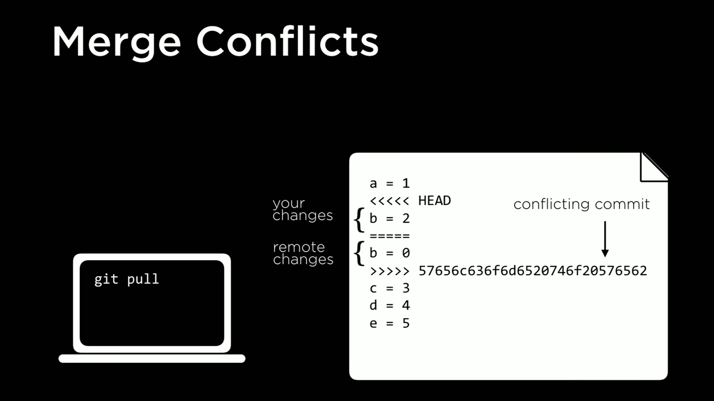
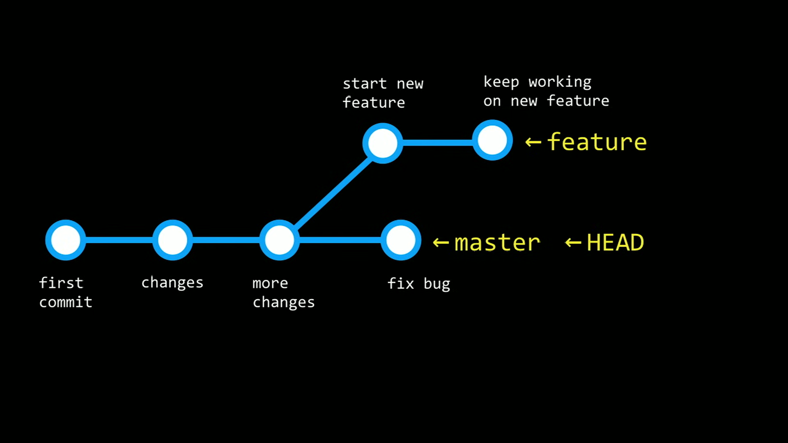

# Git

## Commit

Use `git clone <url>` to clone a git repository.

Once make changes use `git add <file>` to add the file with the changes.

Then you can use `git commit -m "cool message"` to commit the changes with the message telling what's been changed. Or you can also use a combination of `add` and `-m` with `git commit -am` to add and commit the file.

To see all the commits you can use `git log`.

Use `git status` to get a overview of what's going on.

Once everything looks good use `git push` to push the repository to the server.

Sometimes the version that is on the server is a newer version than the one stored on your local computer. To update you can use `git pull` inside the local repository.

## Merge Conflicts

If both developers are working on the same project they might commit changes to the same part of the code and run into a merge conflict.

Is up to the developer to choose how to solve the problem, keep somebodys changes, keep your changes, or combine the changes.

## More Commands

To go back to a older version you can use `git reset`. To go back to a specific commit you can use `git reset --hard <commit hash>` and to go back to what's on the server you can use `git reset --hard origin/master`.

## Branching

When working on a project, over time it will get bigger. It is good practice to separate things. For example, if I am fixing something in one version of the code but want to implement a new feature in the next version, I can separate this with a `branch`. I can have a branch for a new feature while my main branch is where I fix bugs.

The branch that is currently being worked on is designated by something called `HEAD`.

When you are satisfied with the changes in each branch you can `merge` them.

To know what branch you are working you can type `git branch`. To create a new branch you can type `git checkout -b <new-branch>` and to switch to another branch you can type `git checkout <branch-name>`.

And finnaly to merge just type `git merge <branch-name`. Sometimes git will say there's a conflict, don't freak out, just fix and commit the fix.

## Fork

When you want to contribute, modify or create a personal version of an open source code you can create a `fork` of that code. And then make a `pull request` for your code to be reviewed and when everyone is satisfied your contribution will be merged to the main source code.
